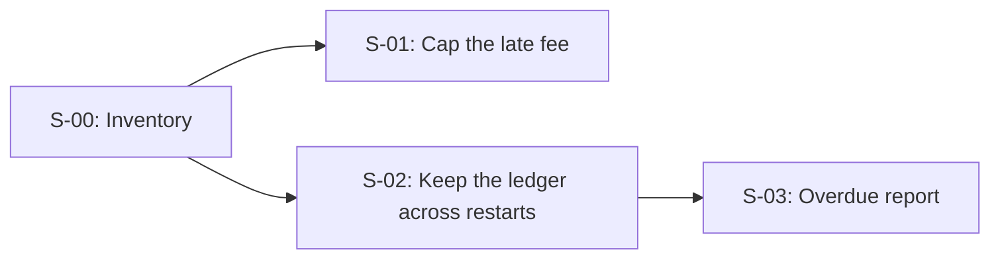

<!-- Generated by recade slices graph. Do not edit. -->

# Slice graph

An arrow goes from a slice to the slices that wait for it. Double sides mean a large slice.

```mermaid
flowchart LR
  S_00["S-00: Inventory"]
  S_01["S-01: Cap the late fee"]
  S_02["S-02: Keep the ledger across restarts"]
  S_03["S-03: Overdue report"]
  S_00 --> S_01
  S_00 --> S_02
  S_02 --> S_03
```
